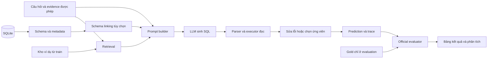

# LLM-based Text-to-SQL Reproduction Implementation Plan

> **For agentic workers:** REQUIRED SUB-SKILL: Use superpowers:subagent-driven-development (recommended) or superpowers:executing-plans to implement this plan task-by-task. Steps use checkbox (`- [ ]`) syntax for tracking.

**Goal:** Tái hiện thực nghiệm đại diện của khảo sát LLM-based Text-to-SQL cho đồ án/luận văn, có baseline, ablation, phân tích chi phí và bằng chứng chạy lại được.

**Architecture:** Một pipeline module hóa dùng chung cho dữ liệu, schema, prompt, LLM, thực thi và đánh giá. Tái hiện DAIL-SQL trên một nhánh giữ cấu hình tác giả; dùng nhánh nghiên cứu riêng để bật/tắt các kỹ thuật C0-C4. Gold SQL chỉ đi vào evaluator hoặc xử lý train, không đi vào inference.

**Tech Stack:** Python, SQLite, pytest, YAML/JSONL, pandas và matplotlib; sentence-transformers cho retrieval; adapter API hoặc Transformers cho LLM. PEFT/QLoRA là nhánh tùy chọn. Khóa phiên bản sau smoke test thay vì lấy toàn bộ dependency mới nhất.

**Spec:** [Phạm vi và phân tích bài báo](../specs/2026-10-06-text-to-sql-reproduction-design.md).

## Global Constraints

- Người dùng đã chọn: thực nghiệm phục vụ đồ án/luận văn, có baseline và ablation.
- Nguồn chính là survey arXiv:2406.08426v5 ngày 13/03/2025; kết quả tự chạy phải được tách khỏi số liệu trích dẫn.
- Không gọi pipeline tự ghép là tái lập nguyên bản DAIL-SQL/DIN-SQL khi khác thuật toán hoặc prompt.
- Chỉ dùng train để fine-tune, dựng kho ví dụ và sinh dữ liệu bổ sung; tuning dùng holdout theo database trong train.
- Cùng model, snapshot dữ liệu, evidence, nội dung DB được phép xem và evaluator cho mọi phép so sánh thuộc một track.
- Không đưa `gold_sql`, gold result hoặc oracle schema linking vào inference; oracle experiment phải tách và ghi nhãn.
- SQL executor chỉ chạy truy vấn đọc trên bản sao DB; không thêm LIMIT hoặc sửa câu SQL để làm điểm benchmark.
- Mỗi run lưu cấu hình, model ID/revision, prompt hash, data/evaluator hash, seed, prediction, thời gian và lỗi.
- Các lệnh `python -m text2sql...` bên dưới là giao diện **sẽ xây**, chưa có mã thực thi trong workspace tại thời điểm lập kế hoạch.

## Review Focus

- Schema lọc mất bảng nối trung gian: giữ đường khóa ngoại cần thiết và đo recall schema; Task 3/7.
- SQL thực thi thành công nhưng sai ngữ nghĩa: evaluator chính thức, không coi successful execution là accuracy; Task 4/8.
- Ví dụ retrieval hoặc cache làm lộ gold/dev: tách kiểu dữ liệu và kiểm tra nguồn ID; Task 2/5/6.
- Kết quả có thứ tự, trùng lặp, NULL hoặc hai truy vấn đều rỗng: giữ raw output và dùng quy tắc evaluator; Task 4/8.
- Model trả output hỏng hoặc request bị ngắt: lỗi có trạng thái rõ, giới hạn retry, resume không thay thứ tự mẫu; Task 5/9.

## 1. Kết quả cuối cùng cần nộp

1. Ma trận tổng quan: nhóm kỹ thuật, đại diện, source, model, dataset, metric và mức tái hiện; bao phủ nội dung survey, không bắt buộc cài tất cả phương pháp.
2. Harness Text-to-SQL và hướng dẫn chạy từ dữ liệu đến bảng kết quả.
3. Tái hiện DAIL-SQL, baseline và ít nhất các phép ablation cốt lõi trong mục 5.
4. Spider full dev và BIRD full dev hoặc một subset đã khóa, ghi rõ phạm vi.
5. Raw predictions, prompt, manifest, evaluator output, thống kê lỗi và chi phí.
6. Báo cáo, biểu đồ trade-off và demo đơn giản nhập câu hỏi -> SQL -> kết quả.

Tên đề tài gợi ý: **Tái hiện và đánh giá các kỹ thuật LLM-based Text-to-SQL: ảnh hưởng của prompt, schema linking và phản hồi thực thi**. Nếu chỉ tái hiện DAIL-SQL và ablation của nó, thu hẹp tên theo DAIL-SQL.

## 2. Kiến trúc và luồng dữ liệu



Pipeline nghiên cứu dự kiến: `schema -> optional linking -> retrieval -> optional decomposition/plan -> generation -> optional refinement/voting`. Đây là tổ hợp phục vụ thí nghiệm, không phải kiến trúc duy nhất của bài survey. Nhánh DAIL theo tác giả giữ luồng và template gốc, không tự thêm module nghiên cứu.

### Hợp đồng dữ liệu

Định nghĩa tại `src/text2sql/contracts.py`; dùng dataclass hoặc Pydantic, chọn một cách và dùng nhất quán.

| Kiểu | Các trường bắt buộc | Người dùng |
|---|---|---|
| `InferenceExample` | `id: str`, `db_id: str`, `question: str`, `evidence: str \| None` | Generator, không chứa gold |
| `GoldRecord` | `id: str`, `gold_sql: str`, `difficulty: str \| None` | Evaluator, phân tích sau chạy |
| `TrainExample` | `input: InferenceExample`, `gold_sql: str` | Retrieval/SFT chỉ từ train |
| `Schema` | bảng, cột, kiểu, PK, FK, metadata, `db_id` | Serializer/linker |
| `SchemaSelection` | `schema: Schema`, selected IDs, lý do ngắn, `fallback: bool` | Linker -> prompt |
| `SQLPlan` | tables, joins, filters, grouping, ordering, nested steps | Biến thể kế hoạch có cấu trúc |
| `GenerationRequest` | messages, model config, seed, max output, stage | LLM adapter |
| `GenerationResult` | raw text, token usage, latency, response ID, status | Trace |
| `ExecutionResult` | status, columns, raw rows, duration, error | Refiner/voter, không có gold |
| `PredictionRecord` | example ID, SQL hoặc lỗi, stage traces, totals | Export/evaluation |

`RunConfig` phân biệt `author_reproduction` và `research_variant`. Cache key chứa model/revision, message hash, decoding config, seed, stage và data snapshot. Schema/content retrieval có ngân sách và log riêng.

### Cấu trúc thư mục sẽ tạo

```text
configs/                       # baseline, ablation, author, model, evaluation
data/manifests/                # URL, snapshot, SHA256, count, split IDs
data/raw/                      # dữ liệu tải, không đưa vào Git
data/processed/                # chuẩn hóa, tách inference/gold
src/text2sql/
  contracts.py                 # kiểu và cấu hình thống nhất
  data.py                      # loader, split theo DB, kiểm tra provenance
  schema.py                    # introspection, DDL, PK/FK
  retrieval.py                 # random, semantic, masked, skeleton
  llm.py                       # adapter và retry có giới hạn
  prompts.py                   # renderer, token budget, prompt hash
  linking.py                   # lọc schema và nối FK
  planning.py                  # decomposition và SQLPlan
  execution.py                 # parser, SQLite read-only, timeout
  refinement.py                # sửa lỗi và chọn ứng viên
  pipeline.py                  # orchestration, không có gold
  run.py                       # CLI run và resume
  evaluation.py                # adapter evaluator chính thức
  analysis.py                  # bảng, bootstrap, lỗi, biểu đồ
  training.py                  # tùy chọn SFT/QLoRA
scripts/                       # prepare_data, build_index, smoke, report
tests/fixtures/                # DB nhỏ có NULL, duplicate, bảng cầu nối
tests/                         # kiểm tra khoa học và tích hợp
third_party/                   # code tác giả và evaluator, pin commit
runs/<run_id>/                 # manifest, prompt, predictions, logs, metrics
reports/                       # literature matrix, reproduction log, report
demo/app.py                    # giao diện tối giản sau benchmark
```

## 3. Chọn dữ liệu và tránh rò rỉ

### Spider 1.0

- Tải từ [trang dataset chính thức](https://yale-lily.github.io/spider); giữ database, `tables.json`, train/dev và test nếu dùng.
- `train_core`: dùng dựng kho ví dụ; tách khoảng 20% database trong train thành `tune_holdout` bằng seed 42. Không tách ngẫu nhiên từng câu hỏi làm hai tập có chung database.
- Chốt hyperparameter trên `tune_holdout`; sau đó dựng lại kho ví dụ từ toàn bộ train và khóa cấu hình trước khi đánh giá dev.
- Pilot 50 câu lấy từ `tune_holdout`, phân tầng độ khó và DB; pilot không phải kết quả cuối.
- Full dev thường có 1.034 câu trong split kinh điển; script phải xác nhận số thực tế từ snapshot, không tự bổ sung/xóa mẫu để khớp số dự kiến.
- Dùng official difficulty labels nếu có, hoặc bộ tính độ khó từ evaluator đã pin; không yêu cầu generator biết độ khó từ gold.

### BIRD-SQL

- Chọn snapshot phù hợp phép so sánh: bản lịch sử phù hợp method hoặc bản dev đã sửa mới. Ghi SHA256 của JSON và DB, số câu và nguồn metadata.
- Dev kinh điển có 1.534 câu; đếm lại snapshot. Dữ liệu mới phải có hàng kết quả riêng. Trang BIRD đã thông báo [bản dev làm sạch `bird-sql-dev-1106`](https://bird-bench.github.io/).
- Pilot 50 câu từ holdout train BIRD; nếu không có train, pilot dev 50 chỉ dùng kiểm tra tích hợp và phải ghi việc đã xem dev.
- Tách `with_evidence` và `without_evidence`; cùng chính sách evidence cho tất cả method trong một bảng. Metadata và cell values cũng phải nhất quán.
- Nếu thiếu tài nguyên: subset 300 câu phân tầng theo độ khó/DB, khóa ID và seed trước khi chạy, dùng nhãn `BIRD-dev-subset-300`; không gọi là full-dev.
- [BIRD Mini-Dev](https://github.com/bird-bench/mini_dev) là track khác, không dùng thay thế ngầm cho BIRD-dev gốc.

### Dữ liệu robustness/tiếng Việt

Chỉ mở sau khi hoàn thành core. Chọn một benchmark sẵn có, giữ liên kết ID giữa câu gốc và câu biến đổi để đo mức giảm accuracy theo cặp. Nếu dùng dữ liệu tự biên soạn, công bố quy trình và gọi là bộ đánh giá bổ sung. Không dùng dữ liệu bổ sung làm vài ví dụ minh họa rồi kết luận hệ thống hỗ trợ tiếng Việt tốt.

## 4. Model, tài nguyên và cấu hình

### Lựa chọn theo tài nguyên

| Điều kiện | Hướng đi | Giới hạn |
|---|---|---|
| Có API, không có GPU | Một model API có ID cụ thể cho cả bảng | Ghi model ID thực nhận/ngày chạy; historical GPT-4 có thể không còn truy cập được |
| Có GPU đủ sau smoke test | Checkpoint code/instruct 7B; đề xuất `Qwen/Qwen2.5-Coder-7B-Instruct` | Đây là model thay thế phục vụ thực nghiệm, không phải model gốc DAIL |
| GPU yếu/CPU | API hoặc model nhỏ/quantized để pilot | Đo tốc độ; không suy ra accuracy của checkpoint lớn |
| Có GPU và thời gian thêm | QLoRA trên cùng checkpoint | Định cỡ theo sequence length và batch thật |

[Model card chính thức Qwen](https://huggingface.co/Qwen/Qwen2.5-Coder-7B-Instruct) cung cấp checkpoint và chat template. Chọn model này vì phù hợp thời kỳ/nhóm code LLM được survey thảo luận; không khẳng định đây là model tốt nhất hiện nay. Pin revision và tokenizer. Cấu hình GGUF/4-bit/bf16 là những track riêng; không coi quantization là không ảnh hưởng kết quả.

Harness mới có thể dùng Python 3.11 sau khi thử compatibility. Mã DAIL nguyên bản có dependency cũ và CoreNLP, nên dùng môi trường riêng theo README. Trên Windows hiện tại, ưu tiên harness CPU/API chạy native; environment DAIL/LLM training có thể chạy WSL2/Linux nếu dependency yêu cầu, và lưu lockfile riêng. Không đổi thuật toán retrieval chỉ để tránh dependency cũ rồi vẫn gọi là tái hiện nguyên bản.

### Cấu hình nghiên cứu ban đầu, được phép điều chỉnh trên tune_holdout

- Seed: 42 cho split; 42, 43, 44 cho run có sampling và kiểm tra ổn định.
- Baseline: deterministic/greedy nếu backend hỗ trợ, max output 512 tokens.
- Few-shot: `k = 0, 1, 3, 5`; cấu hình tác giả DAIL có thể dùng k khác, ghi riêng.
- Schema pruning: chọn tối đa 8 bảng và 40 cột trước bổ sung đường FK; fallback full schema nếu không đủ liên kết và còn context.
- Structured SQLPlan: max output 768 tokens; chỉ lưu kế hoạch thao tác ngắn có cấu trúc.
- Refinement: tối đa 2 lần sửa sau lần sinh đầu; cùng SQL hai lượt liên tiếp thì dừng.
- Voting: `n = 5`; sampling temperature 0.7 cho biến thể nghiên cứu. Track tác giả giữ sampling của tác giả.
- Timeout SQL nghiên cứu: 30 giây/câu, có cơ chế hủy worker. Timeout evaluator chính thức giữ cấu hình chuẩn và ghi riêng.
- Retry transport: tối đa 3 lần cho lỗi mạng/rate limit; không dùng retry transport để sinh lại SQL sai.
- Token budget: theo context limit thực của model; bỏ ví dụ xa nhất trước, không cắt mất question hoặc relation. Overflow phải được log, không âm thầm bỏ mẫu.

Tất cả giá trị trên là cấu hình khởi đầu đề xuất. Giá trị chốt được lưu trước full run; không chỉnh sau khi xem điểm full-dev rồi vẫn gọi là đánh giá chưa tuning.

## 5. Ma trận thực nghiệm

### 5.1. Baseline và tái hiện chính

| ID | Cấu hình | Mục đích | Bắt buộc |
|---|---|---|---|
| B0 | Zero-shot, schema đầy đủ, table/column/type, không ghi FK | Mốc tối giản C0 | Có |
| B1 | B0 + thông tin PK/FK | Đo ảnh hưởng quan hệ schema | Có |
| B2 | B1 + 3 ví dụ random từ train, chỉ question-SQL | Few-shot control | Có |
| B3 | B1 + 3 ví dụ semantic, cùng format và ngân sách B2 | Tác dụng retrieval | Có |
| B4 | B1 + masked-question retrieval, 3 ví dụ | Tác dụng masking | Có |
| D0 | DAIL-SQL theo cấu hình tác giả đã pin | Tái hiện phương pháp cụ thể | Có |
| D1 | D0 + self-consistency theo tác giả | Đo hiệu quả cấu hình voting công bố | Nếu ngân sách đủ |
| N0 | DIN-SQL theo code/prompt tác giả | Đối chiếu decomposition đầy đủ | Tùy chọn |

Trong nhóm B, chỉ thay thành phần được nêu. Token cap là cùng mức; báo cáo token thực tế để thấy một phương pháp có nhiều nội dung hơn hay không. B0 vẫn dùng cùng instruction và hình thức serialization với B1, chỉ bỏ phần quan hệ.

D0 giữ k/template của tác giả nên có thể khác nhóm B. Để suy luận tác động của skeleton selection, dùng một cấu hình DAIL nghiên cứu matched với B4 về k=3, representation, model, budget và preliminary SQL; không dùng chênh lệch B4-D0 làm bằng chứng nhân quả của riêng skeleton.

### 5.2. Biến thể theo taxonomy C1-C4

Chọn `R0 = B4` làm nền cố định, `k=3`; ưu tiên tên trung tính để tránh nhầm với method chính thức.

| ID | Khác R0 | Câu hỏi được kiểm tra |
|---|---|---|
| R-L | Chỉ thêm schema pruning có FK closure | Giảm token có làm mất schema cần thiết? |
| R-D | Chỉ thêm decomposition | Có lợi cho nested/multi-join không? |
| R-P | Chỉ thêm SQLPlan có cấu trúc | Kế hoạch thao tác có giúp accuracy không? |
| R-E | Chỉ thêm sửa lỗi parser/runtime | Sửa được lỗi gì; có làm hỏng câu đang đúng không? |
| R-V | Chỉ sinh 5 ứng viên và execution voting | Thêm compute đổi lấy accuracy thế nào? |
| R-F | R0 + L + D + P + E | Tổ hợp đề xuất; có thể có tương tác |
| R-F-V | R-F + voting | Tùy chọn nếu tổ hợp thực sự hữu ích |

C3 trong khảo sát gồm nhiều kỹ thuật. R-P chỉ kiểm tra kế hoạch có cấu trúc, không đại diện cho mọi kỹ thuật reasoning hay tự động tương đương ACT-SQL.

### 5.3. Ablation bắt buộc và thứ tự tiết kiệm chi phí

1. Chạy B0-B4, D0 và R-L/R-D/R-P/R-E trên `tune_holdout` trước.
2. Chốt `k` bằng B3/B4 với k=1/3/5; không quét mọi k cho mọi pipeline.
3. Ablation DAIL: masked retrieval vs thêm skeleton, và full-example vs question-SQL-only. Giữ model, preliminary prediction, k và ngân sách; đổi tổ chức prompt không đồng thời đổi selection.
4. Chạy R-F và các bản `R-F-minus-L`, `minus-D`, `minus-P`, `minus-E` để đo tác động trong tổ hợp. So với bước 1 để phát hiện tương tác.
5. Voting: thêm control 5 candidates + chọn ứng viên hợp lệ đầu tiên. So control với execution vote để tách tác dụng sampling khỏi tác dụng voting.
6. Khóa matrix core trước full Spider-dev. Core đề xuất: B0-B4, D0, R-F và 4 bản minus; R-V/control/D1 là nhóm bổ sung theo budget.
7. Xác nhận BIRD trên B1, B3, D0, R-F và R-F-minus-E, trong hai track evidence nếu đủ tài nguyên. Nếu chỉ chạy một track, ghi rõ.
8. Nếu R-F không tốt hơn nền, báo cáo kết quả âm; vẫn chạy các ablation có giá trị giải thích, không đổi tổ hợp nhiều lần trên dev để tạo điểm cao.

Single-addition và leave-one-out đo hai điều khác nhau; không dùng một phép đo để khẳng định contribution độc lập trong mọi tổ hợp.

## 6. Đánh giá đúng và đủ

### Accuracy

- **EX:** so kết quả truy vấn dự đoán và gold bằng evaluator phù hợp dataset. Không tự dùng `set(rows)` làm tiêu chuẩn chung vì có thể mất duplicate hoặc thứ tự.
- **Spider TS:** chạy test-suite trên các DB kiểm thử tương ứng; ghi rõ nếu chỉ có DB gốc và chưa tính TS. Kết quả execution trên một DB không được đổi tên thành TS.
- **EM/CM:** dùng structural evaluator và quy tắc chuẩn hóa của Spider; không dùng so sánh nguyên chuỗi SQL. CM chủ yếu để phân tích SELECT/WHERE/JOIN/aggregation-related error khi evaluator hỗ trợ.
- Tất cả lỗi parse, no output, runtime và timeout phải hiện trong denominator. Hạ tầng chưa chạy hết thì trạng thái run là incomplete, không báo thành full-dev.
- Official adapter giữ nguyên output chuẩn. Nếu tự đo kết quả để debugging/voting, đó là helper riêng, không thay official score.

Primary Spider track có value prediction, không thế value gold vào SQL. Chạy TS với quy tắc DISTINCT đã chốt; EM chạy theo cấu hình structural metric tương ứng và xuất flags riêng. [README evaluator](https://github.com/taoyds/test-suite-sql-eval) giải thích khác biệt `--plug_value` và `--keep_distinct`.

### VES và hiệu năng

Theo phương trình (1)-(2) trang 6 của survey:

\[
VES = \frac{1}{N}\sum_{i=1}^{N} \mathbf{1}[V_i=\hat V_i]\sqrt{\frac{t_i^{gold}}{t_i^{pred}}}.
\]

SQL sai được đóng góp 0. Survey mô tả trung bình qua 100 lần chạy để ổn định; khi thực hiện phải dùng implementation/timing protocol của evaluator đã chọn, lưu warm-up, repetition, outlier policy và thang 0-1 hay nhân 100. Không tự thay ratio trung bình bằng ratio của thời gian trung bình rồi coi là cùng metric.

- VES cũ và R-VES là hai metric khác nhau; chỉ đối chiếu số khi cùng công thức và snapshot.
- Benchmark SQL timing chạy riêng, không chạy nhiều worker cùng lúc; cố định máy, DB, SQLite version và cache/warm-up protocol.
- Không sửa index/DB riêng cho một phương pháp. Nếu thí nghiệm tối ưu index, đó là track khác.
- `LLM latency`, `pipeline latency`, `SQL execution time` và `VES` là bốn cột riêng.
- Báo p50/p95 latency, token input/output, API calls, retries, schema-token reduction, GPU peak memory nếu chạy local.

### Thống kê và phân tích

- Báo số đúng/số tổng cùng tỷ lệ; phân tầng theo difficulty, DB và nhóm SQL.
- Bootstrap paired theo database, 2.000 lần, seed 42, CI 95% cho chênh lệch accuracy; bổ sung paired theo câu nếu cần và ghi rõ đơn vị lấy mẫu.
- Sampling/voting chạy 3 seed nếu ngân sách cho phép; báo mean/std. Chạy greedy một lần không đủ để khẳng định tất cả backend hoàn toàn deterministic.
- Phân loại khoảng 100 lỗi, phân tầng difficulty và DB; cho mỗi lỗi chọn một nhãn chính và có thể thêm nhãn phụ: schema, value, join, aggregation, nesting/set operation, ordering, evidence, syntax, timeout, ambiguity.
- Dành một nhóm case study cho câu đúng bị sửa thành sai, câu chạy được nhưng sai, schema bị cắt và vote sai đồng thuận.
- Thảo luận pretraining contamination: không dùng dev trong pipeline không chứng minh model chưa từng gặp benchmark khi pre-train. Có thể thêm DB mới do nhóm tự xây, ghi là đánh giá ngoài benchmark.

## 7. Các task triển khai

Mỗi task kết thúc bằng artifact kiểm tra được. Chỉ commit phần liên quan nếu dự án đã có Git; workspace lúc lập kế hoạch mới có thư mục Paper, nên khởi tạo Git khi bước triển khai bắt đầu nếu cần.

### Task 1: Khóa protocol và nguồn tái lập

**Files:** tạo `reports/literature_matrix.csv`, `reports/reproduction_log.md`, `configs/protocol.yaml`, `configs/evaluation.yaml`, `third_party/manifest.json`.

**Interfaces:** xuất `RunConfig` spec và manifest gồm method, source URL, commit, dataset snapshot, model ID, evaluator/flags; chưa gọi model.

- [ ] Tạo ma trận cho C0-C4 và 4 nhóm FT; mỗi nhóm có ít nhất một đại diện và trạng thái `implemented`, `reviewed-only` hoặc `optional`.
- [ ] Đọc paper/mã DAIL đúng version; ghi các khác biệt quan trọng trước khi sửa SDK hoặc environment. Nếu không truy cập được historical model, chọn model thay thế và ghi nhãn adapted reproduction.
- [ ] Chốt core matrix, primary metric, train/tune/dev policy, evidence và content policy theo các mục 3-6.
- [ ] Pin code tác giả/evaluator; copy hoặc checkout vào thư mục riêng, không sửa trực tiếp mà không ghi diff.
- [ ] Review protocol: mỗi ID có đúng một source/config/model track; mọi số trích dẫn có split và metric.

**Acceptance:** không còn phép so sánh lẫn dev/test, model hoặc VES/R-VES; có thể giải thích từng hàng sẽ chạy.

### Task 2: Loader, manifest và split không rò rỉ

**Files:** tạo `contracts.py`, `data.py`, `scripts/prepare_data.py`, `tests/test_data.py`, `data/manifests/*.json`.

**Interfaces:** `load_dataset(name: str, split: str, manifest_path: Path) -> tuple[list[InferenceExample], dict[str, GoldRecord]]`; `load_train_pool(...) -> list[TrainExample]`; `split_by_database(examples: list[TrainExample], seed: int, holdout_fraction: float) -> tuple[list[TrainExample], list[TrainExample]]`.

- [ ] Viết test `test_split_database_disjoint` và `test_inference_has_no_gold`: DB giao nhau bằng rỗng, inference không có trường gold; run test trước để thấy fail.
- [ ] Tải dữ liệu, tính SHA256, đếm mẫu/DB, xác nhận mọi `db_id` tìm được DB; lưu ID nguồn ổn định.
- [ ] Implement chuẩn hóa; giữ question/evidence nguyên bản; xuất inference JSONL và gold file riêng.
- [ ] Tạo split/pilot và kiểm tra train/tune/dev provenance, duplicate exact question-SQL giữa pool/evaluation; report duplicate thay vì âm thầm xóa official sample.
- [ ] Run `pytest tests/test_data.py -q`; mong đợi toàn bộ test pass và report counts khớp manifest; commit task.

**Acceptance:** sample ID truy ngược được, không thất lạc DB, không dùng dev gold dựng retrieval.

### Task 3: Schema và biểu diễn prompt

**Files:** tạo `schema.py`, `prompts.py`, `tests/test_schema.py`, `tests/test_prompts.py`, `tests/fixtures/bridge.sqlite`.

**Interfaces:** `inspect_schema(db_path: Path) -> Schema`; `serialize_schema(schema: Schema, style: str, include_fk: bool) -> str`; `build_prompt(example: InferenceExample, schema: Schema, demos: list[TrainExample], plan: SQLPlan | None, config: RunConfig) -> GenerationRequest`.

- [ ] Viết test introspection cho identifier có dấu cách, PK composite, FK và tên SQL keyword; kiểm tra serializer giữ identifier chính xác.
- [ ] Implement DDL và table-list styles; B0/B1 chỉ khác thông tin relation, không đổi instruction.
- [ ] Implement token budget theo tokenizer/backend, giảm demos theo rank; overflow trả lỗi rõ, không cắt câu hỏi.
- [ ] Viết `test_prompt_excludes_evaluation_gold`, `test_prompt_keeps_question_on_overflow`; test FK đường cầu nối giao cho Task 7.
- [ ] Run `pytest tests/test_schema.py tests/test_prompts.py -q`; snapshot một prompt từ fixture để review; commit.

**Acceptance:** schema khớp SQLite, prompt rõ dialect và policy, đo được kích thước thật.

### Task 4: Executor và bộ đánh giá chuẩn

**Files:** tạo `execution.py`, `evaluation.py`, `tests/test_execution.py`, `tests/test_evaluation.py`, `tests/fixtures/eval_cases.json`.

**Interfaces:** `execute_readonly(db_path: Path, sql: str, timeout_s: float) -> ExecutionResult`; `evaluate_run(run_dir: Path, dataset_manifest: Path, evaluator_config: Path) -> dict[str, object]`.

- [ ] Viết failing tests: SELECT/CTE đọc được; DELETE/DDL/ATTACH bị từ chối; DB hash không đổi; truy vấn quá lâu bị hủy.
- [ ] Implement parse một statement, SQLite read-only connection, tắt extension, authorizer và worker timeout. Parser hỗ trợ SQLite; không chỉ kiểm tra câu bắt đầu bằng SELECT vì còn WITH/CTE.
- [ ] Tạo fixtures có duplicate, NULL, ORDER BY, empty result, SQL tương đương khác câu chữ và SQL chạy được nhưng sai kết quả.
- [ ] Implement export đúng thứ tự ID sang evaluator Spider/BIRD đã pin. Golden check: gold-as-prediction đạt điểm tối đa trên fixtures hợp lệ; deliberate wrong query bị tính sai. Parser/evaluator limitation phải có log.
- [ ] Tách helper execution fingerprint phục vụ voting khỏi metric chính thức; giữ raw rows đầy đủ, preview bị cắt không đi vào benchmark.
- [ ] Run `pytest tests/test_execution.py tests/test_evaluation.py -q`; chạy evaluator thật trên tiny fixture/subset để xác nhận import/dependency; commit.

**Acceptance:** successful execution không bị tính thành EX; evaluator/flags/run count đều được lưu.

### Task 5: Adapter LLM, runner và baseline

**Files:** tạo `llm.py`, `pipeline.py`, `run.py`, `retrieval.py` với random selector, `configs/b0.yaml` tới `b2.yaml`, `tests/test_runner.py`, `tests/test_retrieval.py` cho random selector.

**Interfaces:** `generate(request: GenerationRequest) -> GenerationResult`; `predict(example: InferenceExample, schema: Schema, config: RunConfig) -> PredictionRecord`; CLI `python -m text2sql.run --config <yaml> --split <split> --limit <int> --seed <int> [--resume <run_dir>]`.

- [ ] Viết test fake backend cho lỗi transport, output rỗng, code fence, hai SQL statements và run bị ngắt; fake backend chỉ dùng test pipeline, không thay số benchmark.
- [ ] Implement adapter, trích SQL không thay nghĩa, logging và bounded retries. Không ghi key/token bí mật vào config/log.
- [ ] Implement run directory chứa config resolved, manifest, `predictions.jsonl`, `prompts.jsonl`, `events.jsonl`, `metrics.json` và official export.
- [ ] Cache/resume theo ID và config hash; đổi seed/model/prompt không được trả cached result từ cấu hình cũ.
- [ ] Implement random selector có seed, kiểm tra pool chỉ từ train_core; chạy pilot 50 câu cho B0/B1/B2. Semantic retrieval và B3 được bổ sung ở Task 6.
- [ ] Run `pytest tests/test_runner.py -q`; kiểm tra evaluator tính đủ 50 bản ghi, kể cả lỗi; commit.

**Acceptance:** một lệnh chạy được baseline end-to-end và resume không nhân đôi/đảo thứ tự.

### Task 6: Tái hiện DAIL-SQL và ablation retrieval

**Files:** mở rộng `retrieval.py`, `tests/test_retrieval.py`; tạo `configs/b3.yaml`, `configs/b4.yaml`, `configs/dail_author.yaml`, `configs/dail_sc_author.yaml`, `scripts/build_index.py`; cập nhật reproduction log.

**Interfaces:** `retrieve(example: InferenceExample, schema: Schema, pool: list[TrainExample], preliminary_sql: str | None, config: RunConfig) -> list[TrainExample]`; index artifact chứa embeddings, train IDs, encoder revision, mask/skeleton algorithm và hash.

- [ ] Viết tests chứng minh retrieval không cần gold của evaluation, stable tie-break bằng ID, masked token/schema khớp và pool source là train.
- [ ] Chạy code DAIL tác giả trên tiny subset trước; giữ bản gốc để đối chiếu prompt, selected IDs và SQL sơ bộ với wrapper.
- [ ] Theo nguồn DAIL: mask question, dùng question embedding và khoảng cách Euclidean; ưu tiên theo similarity của SQL skeleton từ preliminary SQL. Appendix A.1 nêu `all-mpnet-base-v2`, Jaccard skeleton, threshold 0.9 cho experiments và 0.85 cho leaderboard. Chọn **một** setting đã pin; không trộn hai cấu hình. [Nguồn](https://arxiv.org/html/2308.15363v3).
- [ ] Với leaderboard-style setting, preliminary SQL sinh từ model/prompt theo script tác giả; chi phí lượt sơ bộ được tính vào toàn pipeline. Gold SQL evaluation bị cấm làm SQL sơ bộ.
- [ ] Khóa k, representation, template, ordering và fallback theo code gốc; nếu đổi SDK/model, so sánh prompt và ghi sai khác. Bản simplified chỉ semantic top-k gọi là baseline B3/B4.
- [ ] Chạy B3/B4/D0 và ablation selection/organization matched trên tune_holdout; lưu index và selected demo IDs từng câu. D1 nếu mở giữ `n=5`, temperature 1.0 theo cấu hình tác giả.
- [ ] Run `pytest tests/test_retrieval.py -q`; kiểm tra no-gold và một trace nguyên bản-vs-wrapper; commit.

**Acceptance:** có thể nêu chính xác phần tái hiện nguyên bản và phần adaptation; kết quả không phụ thuộc gold test.

### Task 7: Schema linking, decomposition và SQLPlan

**Files:** tạo `linking.py`, `planning.py`, `configs/r_l.yaml`, `r_d.yaml`, `r_p.yaml`, `tests/test_linking.py`, `tests/test_planning.py`.

**Interfaces:** `link_schema(example: InferenceExample, schema: Schema, config: RunConfig) -> SchemaSelection`; `make_plan(example: InferenceExample, schema: Schema, config: RunConfig) -> SQLPlan`; `decompose_question(...) -> list[str]` với tối đa 5 câu con trong biến thể nghiên cứu.

- [ ] Viết test bảng A và C cần JOIN qua B: linker phải giữ B và FK; invalid table/column bị loại hoặc fallback, không phát sinh schema giả.
- [ ] Implement linker: lexical/semantic ranking -> optional LLM selection -> FK closure -> kiểm tra budget. Ghi token trước/sau và lý do fallback.
- [ ] Implement decomposition/SQLPlan JSON với tables, joins, filters, group/order/nesting; validate identifiers. Kế hoạch lỗi được log và fallback generation theo schema gốc, không bỏ mẫu.
- [ ] Đo schema recall sau inference bằng entity từ gold AST trong evaluator/analysis; không đưa oracle schema vào prompt. Ghi đây là proxy, không phải toàn bộ schema ngữ nghĩa tối thiểu.
- [ ] Chạy R-L/R-D/R-P độc lập trên cùng tune_holdout; xem hiệu ứng theo độ khó và token, không chỉ aggregate score.
- [ ] Run `pytest tests/test_linking.py tests/test_planning.py -q`; commit.

**Acceptance:** bảng nối không mất, plan không bịa identifier, có bằng chứng cascade error và fallback.

### Task 8: Sửa lỗi và chọn ứng viên

**Files:** tạo `refinement.py`, `configs/r_e.yaml`, `r_v.yaml`, `r_f.yaml`, `r_f_minus_*.yaml`, `tests/test_refinement.py`, `tests/test_voting.py`.

**Interfaces:** `refine_sql(example: InferenceExample, schema: Schema, sql: str, feedback: ExecutionResult, config: RunConfig) -> PredictionRecord`; `select_candidate(candidates: list[PredictionRecord], executions: list[ExecutionResult], config: RunConfig) -> PredictionRecord`.

- [ ] Viết test missing column được feedback đúng; cùng SQL lặp lại dừng; tối đa 2 lần sửa; selector không được truy cập gold.
- [ ] R-E chỉ sửa parse/runtime failure theo policy; empty result không mặc nhiên là lỗi. Semantic critique của câu chạy thành công, nếu mở, là biến thể riêng.
- [ ] Với R-V, loại ứng viên không hợp lệ rồi nhóm theo execution fingerprint có quy tắc NULL/duplicate/order đã ghi. Fingerprint chỉ là heuristic selection, không là bằng chứng đúng ngữ nghĩa. Nhóm toàn kết quả rỗng cần tie-break minh bạch; không tự thưởng điểm.
- [ ] Tie-break: nhóm nhiều phiếu nhất, sau đó candidate index thấp nhất; không dùng thời gian query ngắn nhất để chọn nếu chưa thiết kế một thí nghiệm riêng.
- [ ] Implement control 5 candidates + first-valid; giữ cùng sampling để so voting. Không có ứng viên hợp lệ trả lỗi có trạng thái.
- [ ] Chạy R-F và leave-one-out; ghi trace trước/sau, correction success/harm và calls per question.
- [ ] Run `pytest tests/test_refinement.py tests/test_voting.py -q`; commit.

**Acceptance:** refinement có giới hạn, voting không dùng đáp án chuẩn, có control compute và tác động âm được ghi.

### Task 9: Full benchmark và thống kê

**Files:** tạo `analysis.py`, `configs/matrix_core.yaml`, `scripts/run_matrix.py`, `tests/test_analysis.py`, `reports/results_*.csv`, `reports/figures/*`.

**Interfaces:** `summarize_runs(run_dirs: list[Path], protocol_path: Path) -> DataFrame`; `paired_bootstrap(results_a: DataFrame, results_b: DataFrame, cluster: str, repeats: int, seed: int) -> tuple[float, float]`.

- [ ] Viết test từ kết quả giả xác nhận sai denominator, thiếu ID, khác evidence/data/model làm phép compare bị từ chối hoặc tách track.
- [ ] Freeze config/index/snapshot; chạy core full Spider-dev, sau đó BIRD theo matrix đã khóa. Lưu failures và retry/resume, không xóa mẫu sai.
- [ ] Chạy official evaluator; dùng wrapper VES/R-VES riêng theo protocol, không đánh giá time chung với worker inference.
- [ ] Chạy 3 seed cho nhóm sampling nếu có budget; tính paired CI và per-difficulty/per-DB summary.
- [ ] Vẽ accuracy-vs-token, accuracy-vs-p95 latency, correction benefit/harm và schema recall-vs-token reduction. So sánh chi phí luôn gồm preliminary SQL, linking, planning, repair và selection calls.
- [ ] Gán nhãn lỗi, ghi case study và hạn chế; không chọn riêng vài ví dụ thành công làm bằng chứng chính.
- [ ] Run `pytest tests/test_analysis.py -q`; check mỗi full-run có đúng tập ID khóa, data/config/evaluator hash; commit.

**Acceptance:** mọi ô kết quả truy ngược được đến raw run và source; không có chữ full-dev trên run thiếu mẫu.

### Task 10: Báo cáo và demo có thể chạy lại

**Files:** tạo `README.md`, `reports/final_report.md`, `reports/reproduce_commands.md`, `demo/app.py`, `scripts/reproduce_smoke.py`.

**Interfaces:** demo dùng `predict` và `execute_readonly` chung; không dựng pipeline riêng khác benchmark.

- [ ] Viết báo cáo theo vấn đề -> survey/taxonomy -> phương pháp chọn -> giao thức -> kết quả -> ablation -> lỗi/chi phí -> giới hạn.
- [ ] Tạo bảng chính có model, dataset version, split, evidence, N, EX/TS/EM, token, calls, p50/p95; số tham khảo tác giả ở bảng riêng.
- [ ] Demo một DB công khai nhỏ, hiển thị câu hỏi, SQL, bảng kết quả và trạng thái lỗi. Nếu tóm tắt kết quả bằng LLM, log riêng và không dùng nó làm metric SQL.
- [ ] Chạy từ environment sạch một smoke subset cố định và regenerate bảng từ stored predictions; xác nhận README chỉ rõ dữ liệu cần tải và lệnh.
- [ ] Review source/reference của bảng taxonomy, nhất là DuSQL và reference ID sai trong survey; commit tài liệu và bản release tái lập.

**Acceptance:** người khác có thể chạy smoke và tái tạo bảng/biểu đồ từ artifact; demo không phải điều kiện thay cho benchmark.

### Task 11, tùy chọn: SFT/QLoRA và augmentation

**Files:** tạo `training.py`, `configs/sft.yaml`, `scripts/prepare_sft.py`, `tests/test_training_data.py`, `reports/ft_results.csv`.

**Interfaces:** `prepare_sft(pool: list[TrainExample], config: RunConfig) -> Path`; `train_adapter(dataset_path: Path, training_config: Path) -> Path`; cùng LLM adapter nạp base hoặc base+adapter.

- [ ] Dùng cùng checkpoint trước/sau SFT, cùng inference representation; split theo DB và kiểm tra không có dev/test trong training data.
- [ ] Cấu hình khởi đầu đề xuất: QLoRA 4-bit, rank 16, alpha 32, dropout 0.05, learning rate 2e-4, 2 epochs, max length 2.048, effective batch 16. Smoke 100 mẫu trước; nếu data bị truncation, sửa context/data policy và ghi run riêng.
- [ ] Loss trên target SQL, mask prompt/padding; checkpoint chọn trên holdout validation, không chọn theo điểm dev.
- [ ] So `base zero-shot`, `base few-shot`, `SFT zero-shot`, `SFT few-shot` với budget/context thống nhất. Thử 3 seed training nếu đủ tài nguyên.
- [ ] Augmentation chỉ từ train: paraphrase hoặc SQL->question; kiểm tra SQL execution, schema validity, loại duplicate và review ngữ nghĩa một mẫu phân tầng. Execution success đơn lẻ chưa xác minh được NL-SQL đúng.
- [ ] Báo thời gian huấn luyện, peak VRAM, số train samples và chi phí teacher nếu có; `pytest tests/test_training_data.py -q` kiểm tra leakage và label masking.

**Acceptance:** so ICL/FT có control cùng checkpoint; không gọi nhánh này là tái hiện CodeS vì chưa làm incremental pre-training của CodeS.

## 8. Lệnh dự kiến và sản phẩm của mỗi lệnh

Các lệnh dưới chỉ chạy được sau khi các task tương ứng đã được implement. Secrets đặt qua environment, không đưa vào command có thể lưu ở báo cáo.

```powershell
# Chuẩn hóa dữ liệu theo manifest đã khóa
python scripts/prepare_data.py --dataset spider --manifest data/manifests/spider.json

# Tạo kho ví dụ từ train; holdout dùng cho tuning
python scripts/build_index.py --config configs/b4.yaml --pool train_core

# Pilot end-to-end trên holdout train
python -m text2sql.run --config configs/b1.yaml --split tune_holdout --limit 50 --seed 42

# Chạy full matrix đã khóa, không còn limit
python scripts/run_matrix.py --matrix configs/matrix_core.yaml

# Đánh giá một run bằng evaluator đã pin
python -m text2sql.evaluation --run runs/<run_id> --manifest data/manifests/spider.json --config configs/evaluation.yaml

# Regenerate báo cáo từ predictions/evaluator output
python -m text2sql.analysis --runs runs --protocol configs/protocol.yaml --output reports
```

`run_matrix` phải in số câu dự kiến, upper bound calls, token-budget estimate trước execution và ghi kế hoạch chạy. Các cấu hình mẫu không có credentials. CLI fail sớm nếu thiếu manifest/model/evaluator, không ngầm dùng demo data.

## 9. Lịch thực hiện đề xuất

Giả định một người, khoảng 15-20 giờ/tuần, đã có nền Python/SQL. Đây là ước lượng kế hoạch, không phải thời gian benchmark đã đo.

| Tuần | Task | Đầu ra và điểm kiểm tra |
|---|---|---|
| 1 | 1-2 | Protocol, literature matrix, nguồn/version, dữ liệu và split |
| 2 | 3-4 | Schema/prompt, executor, evaluator được kiểm tra bằng fixture |
| 3 | 5 | Baseline end-to-end và chi phí pilot thực tế |
| 4 | 6 | DAIL-SQL, retrieval/organization ablation và reproduction log |
| 5 | 7 | Schema linking, decomposition, SQLPlan, single-addition |
| 6 | 8 | Refinement/voting, R-F và leave-one-out, freeze matrix |
| 7 | 9 | Full Spider, xác nhận BIRD, CI, error analysis và biểu đồ |
| 8 | 10 | Báo cáo, demo và kiểm tra tái chạy từ môi trường sạch |
| +2 đến 3 | 11/mở rộng | QLoRA hoặc robustness/tiếng Việt; nên ưu tiên một hướng |

Nếu chỉ có 4 tuần: thu hẹp về B0-B4 + D0, ablation selection/organization trên Spider, một BIRD subset cố định và báo cáo; dời pipeline R-F/FT. Không thu hẹp thành demo mà vẫn giữ tên thực nghiệm đầy đủ.

## 10. Dự toán chi phí có thể kiểm tra

Không chốt số tiền khi chưa biết model/provider hoặc GPU. Pilot đo từng stage và ước tính:

`cost = sum(input_tokens * input_rate + output_tokens * output_rate) / 1_000_000`, dùng đơn giá của model thực chạy ở thời điểm triển khai. Tách cached tokens theo rate tương ứng, không áp chung nếu provider có rate khác.

`total_calls = sum_over_examples(preliminary + linking + decomposition + planning + generation + repair + selection + transport_retry)`.

- Ví dụ minh họa: 8 cấu hình một lượt gọi trên 1.034 câu là 8.272 calls trước retries; pipeline nhiều stage/voting không thể dùng con số này làm dự toán.
- Một baseline 1.534 câu BIRD có 1.534 generation calls, còn metadata/retrieval/preliminary/repair được cộng riêng.
- Đo pilot tối thiểu 50 câu phân tầng; lưu mean/p95 token và latency; dự trù 20% cho retry/thử nghiệm ngoài core.
- Áp trần chi phí/calls theo run config; hết trần checkpoint và ghi incomplete. Không báo điểm full dataset từ phần đã chạy thuận lợi.
- Local GPU: `GPU-hours * đơn giá + storage`; ghi model load/warm-up ngoài và trong latency theo protocol. Peak VRAM phải đo, không cam kết một model/sequence sẽ vừa một GPU cụ thể trước smoke test.

## 11. Rủi ro và quyết định khi xảy ra

| Tình huống | Cách xử lý | Ảnh hưởng kết luận |
|---|---|---|
| Không còn model lịch sử | Adapt model, giữ algorithm/prompt, ghi rõ | Không khẳng định tái lập số cũ |
| DAIL dependency cũ không chạy native | Môi trường riêng Linux/WSL, pin | Thêm thời gian; không thay retrieval âm thầm |
| BIRD snapshot mới sửa gold | Hàng riêng hoặc lấy snapshot lịch sử | Điểm khác có thể do dữ liệu |
| Pruning mất bảng/cột | FK closure, fallback, recall/error trace | Có thể giảm token mà giảm accuracy |
| Refinement chỉ sửa syntax | Đánh giá semantic bằng official evaluator | Executability tăng chưa đủ |
| Voting đồng thuận sai | Control first-valid và case study | Không coi consensus là confidence đã hiệu chuẩn |
| Model/API không ổn định | Response ID/date, seeds, raw outputs | Re-run có thể khác, artifact gốc vẫn kiểm tra được |
| Thiếu budget cho full matrix | Giảm matrix trước freeze hoặc subset khóa | Thu hẹp claim và phạm vi thống kê |
| GPU OOM | Smoke giảm batch/context/model; track riêng | Không trộn model nhỏ với baseline lớn |
| Nhãn gold đáng ngờ | Ghi issue, report official và audit riêng | Không sửa gold im lặng để tăng điểm |

## 12. Checklist hoàn thành và mức kết luận được phép

- [ ] Survey được trích đúng phiên bản; taxonomy và dataset coverage có ma trận.
- [ ] DAIL source/commit/setting và tất cả adaptation có log.
- [ ] Không có gold hoặc dev example trong inference/retrieval/training; provenance đã kiểm tra.
- [ ] Config/model/data/evaluator/evidence được khóa và lưu.
- [ ] Baseline, DAIL và ablation core có output đầy đủ; subset được ghi rõ.
- [ ] Đã phân biệt EX/TS/EM, VES/R-VES và LLM latency.
- [ ] Lỗi/timeout/no-output được tính đầy đủ; benchmark không tự sửa SQL/DB.
- [ ] Có paired CI, difficulty/error breakdown và accuracy-cost trade-off.
- [ ] Có thể regenerate bảng từ artifact và smoke từ môi trường sạch.
- [ ] Báo cáo tách nhận định survey, kết quả tác giả, kết quả tự chạy và giả thuyết mở rộng.

Được kết luận: kỹ thuật A có hiệu quả/không hiệu quả trên các model, snapshot và track đã đo. Không suy rộng thành mọi LLM, mọi database, mọi ngôn ngữ hoặc toàn bộ 4 nhóm FT nếu chưa làm thí nghiệm tương ứng.

## 13. Hướng bổ sung có giá trị cho luận văn

Chọn một hướng sau core, thay vì tăng số method cho đủ bảng:

1. **Routing theo độ khó dự đoán:** chỉ thêm decomposition/refinement khi cần, so với pipeline luôn bật để kiểm chứng accuracy-cost. Predictor chỉ dùng question/schema, không lấy gold difficulty làm input.
2. **Schema linking theo ngân sách token:** tối ưu recall và token với FK closure; đây là giả thuyết đóng góp mới cần thiết kế riêng, không coi đã được chứng minh từ survey.
3. **Tiếng Việt/robustness:** dùng benchmark có nguồn và split rõ, đánh giá paired với câu gốc; phân tích từ đồng nghĩa, thiếu tên cột, dấu/typo và thuật ngữ miền.

Khuyến nghị ưu tiên hướng 1 nếu trọng tâm là chi phí triển khai, hoặc hướng 3 nếu luận văn tập trung giao diện CSDL tiếng Việt. Nhánh SFT là lựa chọn tốt khi đã có GPU và muốn so ICL/FT trên cùng checkpoint; không bắt buộc để hoàn thành phần lõi.
